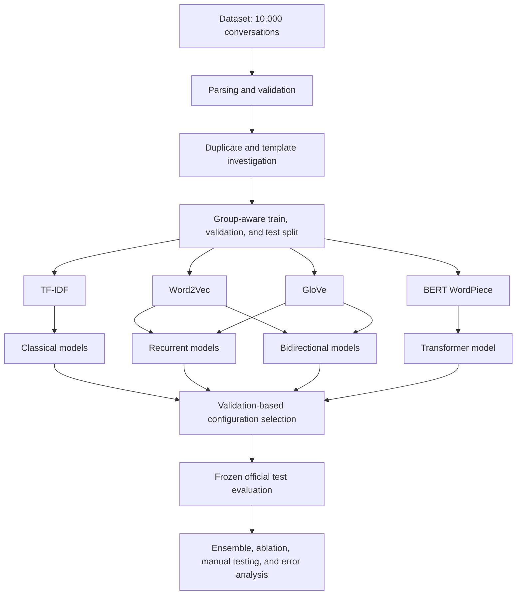
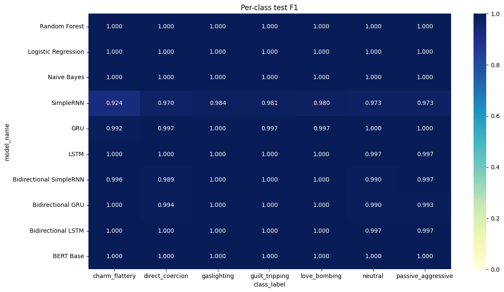

# Psychological Manipulation Type Classification


An end-to-end CSE440 Natural Language Processing II lab project for classifying English conversations into seven psychological-manipulation categories. The study compares sparse lexical models, recurrent and bidirectional neural networks, and BERT under a leakage-aware split, validation-only model selection, and a frozen official test evaluation.

> **Ethical scope:** This is an academic research classifier. It is not a clinical diagnosis, a definitive judgment of abuse, or an automatic decision-maker. Predictions require human interpretation and can fail outside the dataset's synthetic distribution.

## Project at a Glance

| Item | Verified value |
|---|---|
| Dataset | 10,000 English conversations, 21 original fields |
| Target | `manipulation_type` |
| Classes | 7 |
| Split | 6,938 train / 1,608 validation / 1,454 test |
| Leakage control | 0 conversation-ID overlap; 0 template-group overlap |
| Tuning | 30/30 configurations completed |
| Final evaluation | 10/10 selected models completed |
| BERT | 3/3 configurations completed; `BERT_C1` selected |
| Official leaders | Random Forest, Logistic Regression, Naive Bayes, and BERT Base tied at 1.0000 accuracy and macro-F1 |
| Practical recommendation | Logistic Regression: 0.2502 MB and the same official score as 418.5920 MB BERT |

The executed notebook is the primary source of truth: [open the complete notebook](notebooks/CSE440_Psychological_Manipulation_Classification.ipynb).

## Dataset Summary

The [Psychological Manipulation Conversations Dataset](https://www.kaggle.com/datasets/tatheerabbas/psychological-manipulation-conversations-dataset) contains synthetic conversational examples with manipulation labels and descriptive metadata. Models receive only ordered speaker markers and utterance text. Conversation identifiers, descriptive metadata, intensity variables, and target-derived fields are excluded from features.

| Target class | Records | Share |
|---|---:|---:|
| `charm_flattery` | 1,400 | 14% |
| `direct_coercion` | 1,400 | 14% |
| `gaslighting` | 1,400 | 14% |
| `guilt_tripping` | 1,400 | 14% |
| `love_bombing` | 1,400 | 14% |
| `neutral` | 1,600 | 16% |
| `passive_aggressive` | 1,400 | 14% |


*The class distribution is mildly imbalanced, and the 21 original fields have no missing values in the completed run.*

Conversation length varies modestly by class. The recurrent pipeline therefore derives its maximum sequence length from the training split's 95th percentile rather than using an arbitrary global maximum.


## Leakage Investigation and Group-Aware Split

The full 21-field records are unique, but the model text contains substantial repetition:

- 2,081 rows belong to 536 exact duplicate-text groups.
- 2,081 rows also belong to 536 normalized duplicate groups.
- 4,858 rows have nearest-neighbor text similarity of at least 0.98.
- The graph-based grouping step produces 5,902 near-duplicate components; the largest has 70 rows.
- No normalized group or near-duplicate component mixes labels.

Character TF-IDF nearest-neighbor similarity and union-find grouping keep exact and near-duplicate templates together. A 20-fold `StratifiedGroupKFold` assignment then allocates 14 folds to training, three to validation, and three to testing. This yields an approximate 70/15/15 split while preserving groups:

| Split | Records | Share |
|---|---:|---:|
| Training | 6,938 | 69.38% |
| Validation | 1,608 | 16.08% |
| Testing | 1,454 | 14.54% |

Both conversation-ID overlap and template-group overlap are exactly zero.


## Experimental Workflow



### Preprocessing strategies

- **Minimal text:** whitespace and invalid-character cleanup while retaining casing, punctuation, speaker markers, turn order, and negation.
- **Normalized text:** lowercasing, URL and email placeholders, repeated-character control, and whitespace cleanup.
- **No-speaker diagnostic:** ordered utterance text without speaker tokens, used only for a validation ablation.
- **Template normalization:** aggressive punctuation removal used for grouping, never as a predictive feature selected from the test set.

### Text representations

| Representation | Measured setup | Role |
|---|---|---|
| TF-IDF | 2,859 training features; word and character variants | Sparse lexical and n-gram signals for classical models |
| Word2Vec | 100 dimensions; skip-gram fit only on training text | Task-specific recurrent embeddings |
| GloVe | 50 dimensions; `glove-wiki-gigaword-50` | Pretrained static embedding comparison |
| BERT WordPiece | 30,522-token vocabulary; contextual encoding | Transformer fine-tuning with `bert-base-uncased` |

### Ten evaluated model families

1. Random Forest
2. Logistic Regression
3. Naive Bayes
4. SimpleRNN
5. GRU
6. LSTM
7. Bidirectional SimpleRNN
8. Bidirectional GRU
9. Bidirectional LSTM
10. BERT Base

Every family has three recorded configurations. Selection uses validation macro-F1, then validation accuracy as a tie-break; the frozen test set is accessed only after selection.

## Official Frozen Test Results

| Model | Selected config | Accuracy | Macro-F1 | Training (s) | Inference (s) | Size (MB) |
|---|---|---:|---:|---:|---:|---:|
| Random Forest | `RF_C3` | 1.0000 | 1.0000 | 10.2700 | 0.5547 | 30.5229 |
| Logistic Regression | `LR_C1` | 1.0000 | 1.0000 | 1.4822 | 0.1139 | 0.2502 |
| Naive Bayes | `NB_C2` | 1.0000 | 1.0000 | 0.3801 | 0.0847 | 0.4031 |
| SimpleRNN | `SRNN_C3` | 0.9732 | 0.9692 | 74.7046 | 0.9380 | 1.0122 |
| GRU | `GRU_C3` | 0.9979 | 0.9977 | 7.8851 | 0.3630 | 1.1776 |
| LSTM | `LSTM_C3` | 0.9993 | 0.9992 | 8.0176 | 0.4190 | 1.2578 |
| Bidirectional SimpleRNN | `BSRNN_C3` | 0.9966 | 0.9960 | 108.8325 | 1.3698 | 1.1083 |
| Bidirectional GRU | `BGRU_C1` | 0.9972 | 0.9968 | 5.3663 | 0.4949 | 0.6388 |
| Bidirectional LSTM | `BLSTM_C3` | 0.9993 | 0.9992 | 11.0800 | 0.5925 | 1.5995 |
| BERT Base | `BERT_C1` | 1.0000 | 1.0000 | 216.5061 | 2.3020 | 418.5920 |

Random Forest, Logistic Regression, Naive Bayes, and BERT Base **tie** on the official test set. Random Forest is not a unique winner. Logistic Regression is the practical deployment recommendation because it matches the official score while requiring approximately **0.25 MB**, compared with approximately **418.59 MB** for BERT.




## Key Findings

- Advanced neural models do not automatically outperform a strong sparse baseline on this dataset.
- The dataset is synthetic, class wording contains strong lexical cues, and recurring templates remain even after group-aware separation.
- TF-IDF captures those lexical and n-gram cues efficiently; Logistic Regression reaches the same official result as BERT with dramatically lower storage and compute.
- Group-aware splitting prevents direct template-component overlap, but it cannot make a templated synthetic benchmark equivalent to real conversations.
- The manual diagnostics reveal weaker performance outside the official synthetic distribution.

### Ensemble

Validation selected a probability ensemble containing Random Forest, Bidirectional LSTM, and BERT Base with weights 0.2, 0.6, and 0.2. It produced 1.0000 test accuracy and macro-F1, but the best individual score was already 1.0000. Therefore, `genuine_macro_f1_improvement` is **False**.

### Ablation study

The ablations use validation data only. Speaker markers and minimal versus normalized text both tie at 1.0000 for the Logistic Regression probe. Word2Vec average embeddings outperform GloVe (0.9992 versus 0.9625 macro-F1), and bidirectionality substantially helps the comparable SimpleRNN and GRU C1 configurations. The ordinary stratified diagnostic also reaches 1.0000, illustrating why a perfect score alone does not establish leakage-safe generalization.


### Manual-example diagnostics

The seven manually written conversations form a separate qualitative diagnostic; they are not part of the official test score.

| Model | Correct | Diagnostic accuracy | Macro-F1 |
|---|---:|---:|---:|
| BERT Base | 6/7 | 0.8571 | 0.8095 |
| Logistic Regression | 6/7 | 0.8571 | 0.8095 |
| Naive Bayes | 6/7 | 0.8571 | 0.8095 |
| Random Forest | 5/7 | 0.7143 | 0.6190 |
| GRU | 5/7 | 0.7143 | 0.6190 |
| Bidirectional LSTM | 5/7 | 0.7143 | 0.6190 |
| LSTM | 4/7 | 0.5714 | 0.5238 |
| Bidirectional SimpleRNN | 4/7 | 0.5714 | 0.4762 |
| Bidirectional GRU | 4/7 | 0.5714 | 0.4524 |
| SimpleRNN | 4/7 | 0.5714 | 0.4286 |

A second, independent Logistic Regression diagnostic contains fourteen examples and scores 11/14 (78.57%). These two manual evaluations must not be combined with the 1,454-record frozen test evaluation. Their lower results indicate weaker generalization beyond the dataset's synthetic phrasing.

### Error analysis

The tie-selected Random Forest representative has zero official test errors. SimpleRNN, the weakest official model, makes 39 errors; its most frequent confusion is `charm_flattery` → `love_bombing` (10 cases), followed by `passive_aggressive` → `neutral` (7 cases). SimpleRNN accuracy is 0.9412 for short, 0.9742 for medium, and 0.9775 for long conversations; the family context is its weakest subgroup at 0.9669.

The complete normalized confusion matrices are available in [`assets/figures/all_normalized_confusion_matrices.png`](assets/figures/all_normalized_confusion_matrices.png).

## Limitations

- Synthetic conversations and recurring lexical templates can make the official benchmark easier than real-world language.
- English content is supported by the dataset examples, English preprocessing, and a 1.0000 mean ASCII-character ratio; no separate language-identification model was run.
- Model timing depends on the Kaggle runtime and should be treated as measured run data, not a hardware-independent benchmark.
- The manual sample sizes are small and diagnostic rather than statistically representative.
- Labels simplify context-dependent interpersonal behavior into a single class.
- Perfect official scores do not establish clinical, legal, or safety reliability.

## Reproduce on Kaggle

1. Create a Kaggle notebook with a **T4 GPU** accelerator.
2. Enable **Internet** so KaggleHub, GloVe, and `bert-base-uncased` can be resolved.
3. Attach `tatheerabbas/psychological-manipulation-conversations-dataset` through **Add Input**, or let the notebook call `kagglehub.dataset_download`.
4. Upload [the notebook](notebooks/CSE440_Psychological_Manipulation_Classification.ipynb).
5. Run all cells in order. The full workflow includes 30 tuning configurations and three BERT runs; it is intentionally compute-intensive.
6. Retrieve outputs from `/kaggle/working/CSE440_Project_Outputs`.

The completed reference run used Kaggle Python 3.12.13, TensorFlow 2.20.0, PyTorch 2.10.0 with CUDA, and a Tesla T4 runtime. See the complete [reproducibility guide](docs/REPRODUCIBILITY.md) before rerunning.

## Repository Structure

```text
cse440-lab-project/
├── README.md
├── .gitignore
├── requirements.txt
├── notebooks/
│   └── CSE440_Psychological_Manipulation_Classification.ipynb
├── assets/
│   └── figures/
├── results/
│   ├── README.md
│   └── tables/
├── docs/
│   ├── PROJECT_REPORT.md
│   ├── METHODOLOGY.md
│   ├── RESULTS.md
│   └── REPRODUCIBILITY.md
└── data/
    └── README.md
```

## Detailed Documentation

- [Project report](docs/PROJECT_REPORT.md)
- [Methodology](docs/METHODOLOGY.md)
- [Results and interpretation](docs/RESULTS.md)
- [Reproducibility guide](docs/REPRODUCIBILITY.md)
- [Dataset instructions](data/README.md)
- [Result-table inventory](results/README.md)

## Dataset Acknowledgment

The dataset is provided through Kaggle by its original publisher under the slug `tatheerabbas/psychological-manipulation-conversations-dataset`. This repository does not redistribute the raw records.

Repository owner: [rifatpriyo](https://github.com/rifatpriyo)
