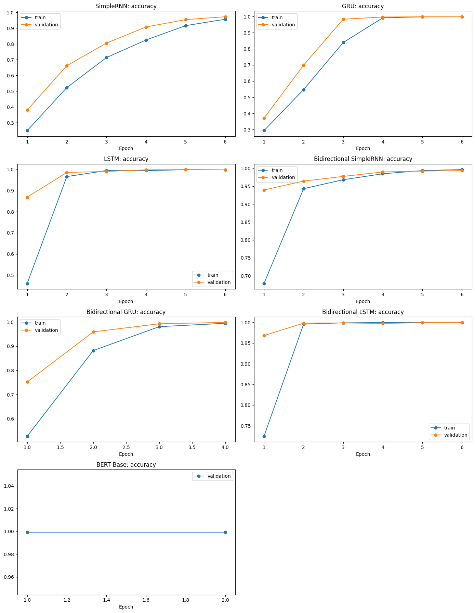

# Methodology

## Experimental Principles

The study follows three controls throughout:

1. Only ordered utterance text and speaker/turn markers may enter predictive features.
2. Every representation and model choice is fit or selected using training and validation data only.
3. The official test partition remains frozen until one configuration per model family has been selected.

The random seed is 42. The completed reference run uses the Kaggle Python 3.12 environment with CUDA available to TensorFlow and PyTorch.

## Message Parsing

Each record contains a nested `messages` field. The parser accepts either an already materialized Python list or a string representation. String values are parsed with `json.loads`; if JSON parsing fails, `ast.literal_eval` is attempted. Values that are not lists, dictionaries without usable text, and unparseable conversations receive an explicit parse status.

Only two nested keys are retained:

- `speaker`
- `text`

The source messages also expose `sentiment_score`, but it is deliberately discarded. All 10,000 conversations parse successfully in the completed run.

### Speaker and turn markers

Each valid utterance is converted to a sequence such as:

```text
[SPEAKER_A] first utterance [TURN] [SPEAKER_B] response
```

This representation preserves conversational order and speaker changes without exposing conversation identifiers or descriptive metadata. Three text fields are derived:

- `text_minimal`: speaker markers, turn markers, original casing, punctuation, and cleaned whitespace;
- `text_no_speakers`: ordered utterances without speaker labels, used for one validation ablation;
- `text_normalized`: lowercased minimal text with URL/email placeholders, repeated-character control, and whitespace normalization.

A fourth field, `template_text`, removes punctuation after normalization. It is used only to detect related templates and define split groups.

## Metadata Exclusion

The original table has 21 fields, including identifiers and descriptive variables such as context, intensity, response delay, escalation pattern, personality measures, sentiment, word counts, and target-related measurements. None of those fields enter model features.

The notebook checks the feature set against a forbidden-field set and confirms an empty intersection. `context_type`, word count, and related descriptors are retained only for description and post-hoc error analysis. The target is `manipulation_type`.

## Duplicate and Template Investigation

Two different meanings of “duplicate” are kept separate:

- There are zero duplicate complete records when all fields are compared as strings.
- There are 2,081 rows belonging to 536 exact duplicate `text_minimal` groups.

The normalized template comparison also identifies 2,081 rows in 536 duplicate groups and no conflicting-label normalized groups.

To capture near duplicates, template text is represented with character `char_wb` TF-IDF using 3–5-grams, `min_df=2`, and at most 30,000 features. Brute-force cosine nearest neighbors are computed, retaining relationships with similarity at least 0.98. Exact duplicates and thresholded near-neighbor edges are merged using union-find.

The resulting 5,902 components have a largest size of 70 and no mixed-label components. A total of 4,858 rows have nearest-neighbor similarity of at least 0.98.


## Group-Aware Splitting

`StratifiedGroupKFold` creates 20 shuffled folds using `template_group_id` as the group and `manipulation_type` as the stratification target. Fourteen folds are assigned to training, three to validation, and three to testing.

| Partition | Records | Percentage |
|---|---:|---:|
| Training | 6,938 | 69.38% |
| Validation | 1,608 | 16.08% |
| Testing | 1,454 | 14.54% |

Integrity assertions confirm:

- every record receives exactly one split;
- the three partitions contain all 10,000 records;
- split shares remain within two percentage points of 70/15/15;
- conversation-ID overlap is zero;
- template-group overlap is zero.

The saved class distribution is available in [`split_distribution.csv`](../results/tables/split_distribution.csv).

## Training-Only Feature Fitting

The split occurs before predictive representations are fit.

- TF-IDF vocabulary and inverse-document-frequency weights are learned from training text only.
- Word2Vec is trained only on tokens from the training conversations.
- The Keras tokenizer is fit only on training text; its sequence length is set to the training distribution's 95th percentile (70 tokens).
- GloVe is pretrained externally, but the embedding matrix is restricted to the vocabulary learned by the training-fitted tokenizer.
- Model parameters are fit only on training labels.

The general TF-IDF comparison uses word 1–2-grams, `min_df=2`, a 40,000-feature ceiling, sublinear term frequency, and `float32`. The observed matrix has 2,859 training features. Validation and test token out-of-vocabulary rates relative to this vocabulary are 0.3414 and 0.3346.

### Word2Vec

The train-only skip-gram model uses 100 dimensions, window 5, `min_count=2`, negative sampling with 10 negatives, 12 epochs, one worker, and seed 42. Its vocabulary contains 585 items, with 0.9915 training-vocabulary coverage under the representation audit.

### GloVe

The pretrained comparison uses `glove-wiki-gigaword-50`: 50 dimensions and a 400,000-token source vocabulary. Training-vocabulary coverage is 0.9424; measured validation and test token out-of-vocabulary rates are 0.2943 and 0.2845.

### BERT WordPiece

`bert-base-uncased` supplies a 30,522-token WordPiece vocabulary and contextual representations. The BERT input uses minimal conversation text and model-specific maximum lengths of 96 or 128 tokens.

## Validation-Only Configuration Selection

The experiment records three configurations for each of ten model families:

- 9 classical configurations;
- 18 recurrent or bidirectional configurations;
- 3 BERT configurations.

All 30 runs complete. Within each model family, configurations are ranked by validation macro-F1 and then validation accuracy. The selected configuration is recorded before official test inference. No test score participates in preprocessing selection, architecture selection, hyperparameter selection, or ensemble-weight selection.

The complete audit is in [`tuning_runs.csv`](../results/tables/tuning_runs.csv), and the selected subset is in [`selected_configurations.csv`](../results/tables/selected_configurations.csv).

## Classical Models

### Random Forest

Random Forest configurations compare word and character TF-IDF followed by Truncated SVD. The selected `RF_C3` pipeline uses minimal text, character 3–5-gram TF-IDF, 220 SVD components, and 300 trees with maximum depth 45, `min_samples_leaf=1`, and logarithmic feature selection.

### Logistic Regression

The three configurations compare word/character TF-IDF, minimal/normalized text, regularization strength, and class weighting. The selected `LR_C1` pipeline uses minimal text, word 1–2-gram TF-IDF, `C=1.0`, the `lbfgs` solver, and no class weights.

### Naive Bayes

The Multinomial Naive Bayes configurations compare word/character TF-IDF and smoothing values. The selected `NB_C2` pipeline uses normalized text, word 1–2-gram TF-IDF, sublinear term frequency, and `alpha=0.5`.

Each fitted pipeline is serialized in the original Kaggle output bundle for later frozen-test inference. Serialized estimators are excluded from this repository.

## Recurrent Networks

The recurrent families are SimpleRNN, GRU, and LSTM. Each receives sequences from the training-fitted tokenizer and an embedding matrix derived from Word2Vec or GloVe. A recurrent encoder feeds dropout and a seven-unit softmax layer. Optimization uses Adam and sparse categorical cross-entropy.

Three comparable variants are evaluated for every recurrent family:

| Variant | Units | Dropout | Learning rate | Batch | Epochs | Embedding | Trainable |
|---|---:|---:|---:|---:|---:|---|---|
| C1 | 32 | 0.25 | 0.0010 | 128 | 4 | Word2Vec | No |
| C2 | 64 | 0.35 | 0.0007 | 128 | 5 | GloVe | No |
| C3 | 48 | 0.40 | 0.0005 | 64 | 6 | Word2Vec | Yes |

Selected configurations are `SRNN_C3`, `GRU_C3`, and `LSTM_C3`.

## Bidirectional Networks

Bidirectional SimpleRNN, Bidirectional GRU, and Bidirectional LSTM wrap the same base recurrent layers in a bidirectional encoder. They use the same C1–C3 grid, enabling controlled validation comparisons with the unidirectional versions.

Selected configurations are `BSRNN_C3`, `BGRU_C1`, and `BLSTM_C3`. Bidirectionality most strongly improves the comparable C1 SimpleRNN validation macro-F1 (0.5669 to 0.9714) and also improves GRU (0.9604 to 0.9983) and LSTM (0.9929 to 0.9987).

The repository includes the stored neural validation-accuracy curves. The combined loss figure is omitted because its BERT panel was not populated by the plotting field mapping; BERT training itself completed and its epoch logs are present in the notebook.



## BERT Fine-Tuning

Three `bert-base-uncased` configurations vary learning rate, effective batch behavior, weight decay, epochs, dropout, and maximum length:

| Configuration | LR | Batch | Gradient accumulation | Weight decay | Epochs | Dropout | Max length |
|---|---:|---:|---:|---:|---:|---:|---:|
| `BERT_C1` | 2e-5 | 16 | 1 | 0.01 | 2 | 0.10 | 96 |
| `BERT_C2` | 3e-5 | 8 | 2 | 0.01 | 3 | 0.15 | 128 |
| `BERT_C3` | 1.5e-5 | 16 | 1 | 0.02 | 3 | 0.20 | 128 |

`AutoModelForSequenceClassification` adds a seven-class head to the pretrained encoder. Training uses Hugging Face `Trainer`, epoch-level validation and checkpointing, linear scheduling with 10% warmup, AdamW, FP16, pinned-memory loading, deterministic seeds, and validation macro-F1 for best-checkpoint selection. The reference run exposes a Tesla T4 CUDA device and reports 109,487,623 trainable parameters.

All three configurations complete. `BERT_C1` is selected with validation macro-F1 0.9995 and then evaluated once on the frozen test set.

## Frozen Test Evaluation

The official test partition contains 1,454 records. For each selected model, the notebook records:

- accuracy;
- macro-F1 and weighted-F1;
- per-class precision, recall, and F1;
- raw and normalized confusion matrices;
- measured configuration training time;
- full-test inference time;
- serialized model size.

Probability arrays and predictions are retained in the original Kaggle output bundle for ensemble and error analysis. They are excluded here because they are large or unnecessary for interpreting the completed results.

## Ensemble Construction

One validation-selected candidate is taken from each complementary family group:

- Random Forest from the classical models;
- Bidirectional LSTM from the recurrent/bidirectional models;
- BERT Base from the transformer models.

Soft-voting weights are searched on validation probabilities only. Candidate weights are formed from equal weights and normalized products of 1, 2, and 3. The selected weights are 0.2 for Random Forest, 0.6 for Bidirectional LSTM, and 0.2 for BERT Base.

The chosen ensemble is applied once to the stored test probabilities. It reaches 1.0000 test macro-F1 but does not improve on the tied leading individual models, so the improvement flag is `False`.

## Manual Diagnostics and Error Analysis

Two diagnostic sets remain separate from the official evaluation:

- seven manually written conversations evaluated across all ten selected models;
- fourteen additional conversations evaluated only with Logistic Regression.

These examples probe phrasing outside the synthetic test distribution. They do not influence model selection or official metrics.

For formal error analysis, the notebook examines the deterministic tie-selected Random Forest representative and the lowest-scoring official model, SimpleRNN. It summarizes confusion pairs, confidence, manipulation-to-neutral errors, length buckets, context subgroups, and representative mistakes. Context and length are used only after prediction for analysis.
