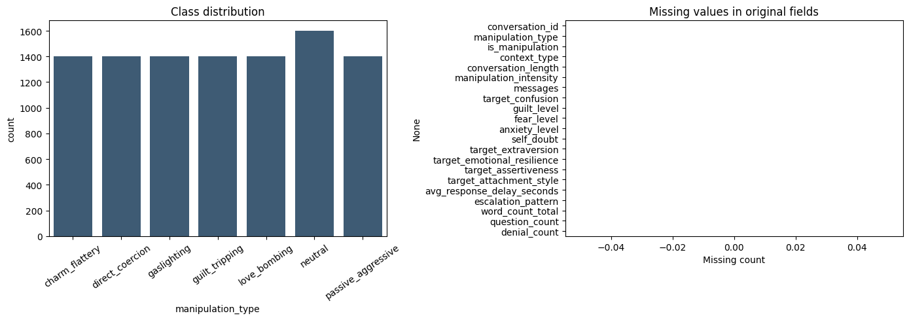
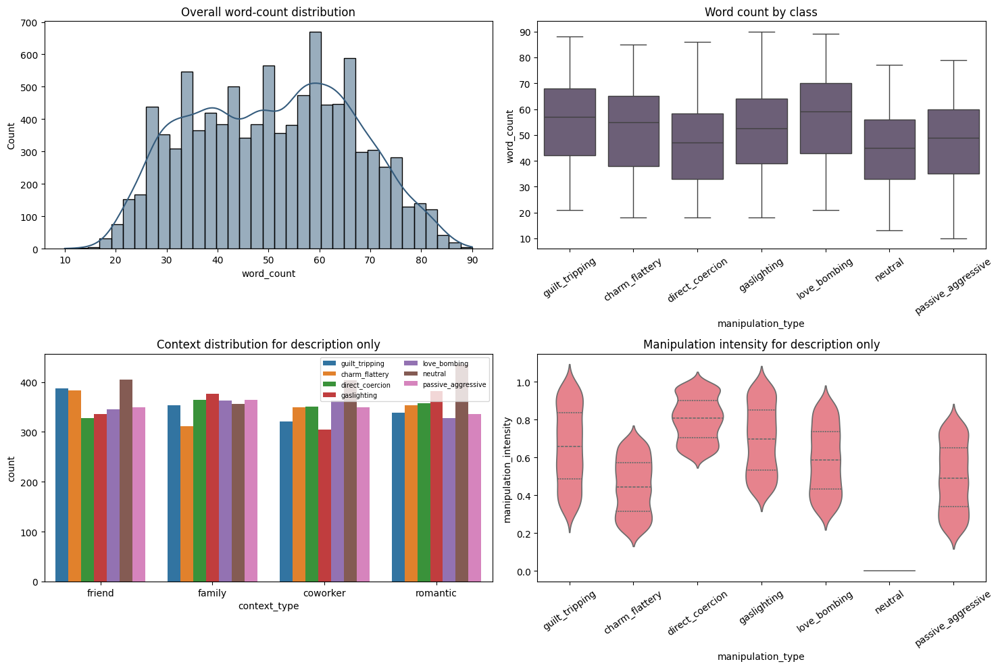
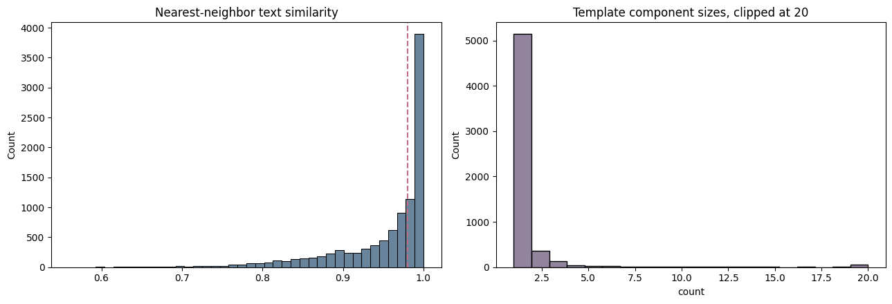
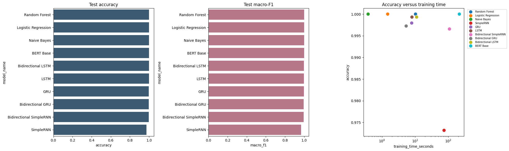
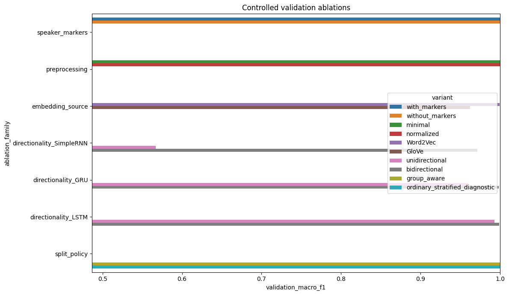

# Project Report

## Psychological Manipulation Type Classification

- **Course:** CSE440 — Natural Language Processing II Lab Project
- **Repository owner:** `rifatpriyo`

## Abstract

This project studies seven-way classification of English synthetic conversations into `charm_flattery`, `direct_coercion`, `gaslighting`, `guilt_tripping`, `love_bombing`, `neutral`, and `passive_aggressive`. The completed experiment evaluates TF-IDF, train-only Word2Vec, pretrained GloVe, and BERT WordPiece representations across ten model families. A duplicate and template investigation precedes a stratified group-aware split so that conversation identifiers and near-duplicate template components remain disjoint across training, validation, and testing. Thirty validation configurations and ten frozen test evaluations complete successfully. Random Forest, Logistic Regression, Naive Bayes, and BERT Base tie at 1.0000 accuracy and macro-F1 on the official synthetic test set. Logistic Regression is recommended as the practical benchmark model because it matches that result at approximately 0.25 MB, compared with approximately 418.59 MB for BERT. Lower performance on manually written examples demonstrates that perfect in-distribution scores do not imply robust real-world generalization.

## Introduction

Psychological manipulation is communicated through phrasing, implication, conversational structure, and context. Computational classification can help study linguistic patterns, but the labels are interpretive and the consequences of mistakes can be serious. A responsible academic experiment must therefore separate benchmark performance from any claim of diagnosis or definitive interpersonal judgment.

This project compares simple lexical methods with recurrent, bidirectional, and transformer models under one controlled pipeline. The comparison is designed to answer four questions:

1. How do TF-IDF, train-only Word2Vec, pretrained GloVe, and contextual WordPiece representations behave on this dataset?
2. Do recurrent, bidirectional, or transformer models improve over classical baselines?
3. How much do preprocessing, speaker markers, embedding source, directionality, and split policy affect validation results?
4. Do official test results hold on small examples written outside the dataset's recurring templates?

## Problem Statement

Given an ordered conversation containing speaker and turn markers, predict one of seven `manipulation_type` labels. The model input is restricted to utterance text and conversational ordering. Identifiers and descriptive metadata must not enter predictive features.

The principal metric is macro-F1 because every class should contribute equally to model selection. Accuracy and weighted-F1 are also recorded. Configuration selection is performed on validation data; the official test partition is frozen until selection is complete.

## Dataset

The experiment uses the Kaggle [Psychological Manipulation Conversations Dataset](https://www.kaggle.com/datasets/tatheerabbas/psychological-manipulation-conversations-dataset), slug `tatheerabbas/psychological-manipulation-conversations-dataset`. The completed notebook reads `manipulational_conversation.jsonl` and validates a shape of 10,000 rows and 21 original columns.

The target distribution is mild rather than severe: `neutral` has 1,600 records, while each manipulation class has 1,400. All conversation identifiers are unique, all nested conversations parse successfully, and the 21 original fields have no missing values.

The text and examples are English, the pipeline uses English lexical processing, and the mean ASCII-character ratio is 1.0000. No formal language-identification model is applied, so “English” should be understood as a dataset property supported by inspection and validation rather than an independently estimated language label.

The raw dataset is excluded from the repository. Download and attachment instructions are provided in [`data/README.md`](../data/README.md).

## Exploratory Analysis

Conversations contain 3–8 turns, with a mean of 5.50. The mean minimal-text length is 293.84 characters, 50.74 words, and 56.83 tokens. Word-count variation between classes is modest; mean class values range from 44.72 for neutral to 57.07 for love bombing.

Frequent unigram and bigram features expose strong recurring cues and structural tokens. Per-class word clouds likewise show differentiated lexical patterns. These findings motivate both TF-IDF baselines and a careful template analysis: highly recognizable lexical cues can yield excellent classification while masking limited distributional breadth.

The contextual and intensity fields shown in exploration are descriptive only. They are not model features.

## Leakage Investigation

A complete-record duplicate check finds zero duplicate rows because identifiers and metadata distinguish the records. Text-level analysis gives a different and more relevant result: 2,081 rows belong to 536 exact duplicate `text_minimal` groups. The same counts appear after template normalization. No normalized group contains conflicting labels.

Near-duplicate analysis represents normalized text with character 3–5-gram TF-IDF and computes cosine nearest neighbors. At a threshold of 0.98, 4,858 rows have a sufficiently similar nearest neighbor. Union-find combines exact and near-duplicate links into 5,902 components. The largest component contains 70 rows, and no component mixes labels.

These components define the groups used by the split. This prevents an exact or threshold-connected template component from appearing in more than one partition. It does not remove templates from the dataset, and it does not guarantee that semantically related phrasings are absent across components.

## Methodology

The notebook follows a single ordered workflow:

1. install or verify the Kaggle-compatible package stack;
2. locate and validate the approved dataset;
3. parse messages and construct text fields;
4. exclude metadata from predictive inputs;
5. investigate exact and near-duplicate templates;
6. create a group-aware train/validation/test split;
7. fit representations on permitted training data;
8. execute three configurations for each model family;
9. select by validation macro-F1 and validation accuracy;
10. evaluate selected models once on the frozen test set;
11. run ensemble, ablation, manual-example, and error analyses.

The resulting split contains 6,938 training, 1,608 validation, and 1,454 test records. Both conversation-ID overlap and template-group overlap are zero.

Full implementation details appear in [Methodology](METHODOLOGY.md).

## Preprocessing

The parser keeps only each message's `speaker` and `text` fields. Conversations are reconstructed with `[SPEAKER_A]`, `[SPEAKER_B]`, and `[TURN]` tokens to preserve order.

The minimal strategy removes invalid replacement characters, normalizes nonbreaking spaces, and collapses whitespace without discarding casing, punctuation, negation, or conversational markers. The normalized strategy additionally lowercases text, replaces URLs and email addresses with placeholders, and limits long repeated-character sequences. A no-speaker version supports a controlled ablation. Template-normalized text is used only for grouping.

The validation ablation finds that minimal and normalized Logistic Regression both reach 1.0000 macro-F1, as do the with-marker and without-marker variants. These ties show that the dominant lexical signal is not dependent on either tested transformation.

## Representations

### TF-IDF

The main training-only word TF-IDF representation produces 2,859 features. Classical configurations also examine character TF-IDF, and Random Forest combines sparse TF-IDF with Truncated SVD. TF-IDF is particularly appropriate when labels have repeated lexical and short-phrase cues.

### Word2Vec

A 100-dimensional skip-gram model is fit only to training conversations. It uses a five-token window, `min_count=2`, negative sampling, and 12 epochs. Word2Vec provides task-specific embeddings for recurrent models and average-embedding ablations.

### GloVe

The pretrained `glove-wiki-gigaword-50` vectors provide a 50-dimensional static semantic comparison. Their broad source vocabulary offers general coverage but may be mismatched to synthetic conversational cues.

### BERT WordPiece

`bert-base-uncased` supplies contextual encoding and a 30,522-token WordPiece vocabulary. A seven-class sequence-classification head is fine-tuned on training conversations, with validation-only checkpoint selection.

## Models

The three classical models are Random Forest, Logistic Regression, and Multinomial Naive Bayes. The recurrent families are SimpleRNN, GRU, and LSTM. Each is paired with a bidirectional counterpart, producing six neural sequence families. BERT Base is the transformer model.

This produces ten final model names:

1. Random Forest
2. Logistic Regression
3. Naive Bayes
4. SimpleRNN
5. GRU
6. LSTM
7. Bidirectional SimpleRNN
8. Bidirectional GRU
9. Bidirectional LSTM
10. BERT Base

## Hyperparameter Tuning

Each family has three configurations. The nine classical runs vary preprocessing, word versus character TF-IDF, n-gram range, feature limits, SVD parameters, regularization or smoothing, and estimator settings. The 18 recurrent runs use a shared C1–C3 grid varying units, dropout, learning rate, batch size, epoch count, embedding source, and embedding trainability. The three BERT runs vary learning rate, batch and gradient accumulation, weight decay, epoch count, dropout, and maximum sequence length.

All 30 configurations complete. Within each family, validation macro-F1 is the first ranking criterion and validation accuracy is the second. The selected configurations are recorded in [`selected_configurations.csv`](../results/tables/selected_configurations.csv).

The BERT configurations all reach 0.9995 validation macro-F1 at displayed precision. `BERT_C1` is selected; it uses a learning rate of 2e-5, batch size 16, weight decay 0.01, two epochs, dropout 0.10, and maximum length 96.

## Evaluation

The selected configurations are applied once to the frozen test partition. The experiment records accuracy, macro-F1, weighted-F1, per-class metrics, confusion matrices, measured training time, full-test inference time, and serialized model size.

The official metrics are kept separate from two manual diagnostics. Seven newly written examples are evaluated across all ten models, while fourteen other examples are evaluated only by Logistic Regression. Neither set affects model selection.

## Results

| Model | Accuracy | Macro-F1 | Size (MB) |
|---|---:|---:|---:|
| Random Forest | 1.0000 | 1.0000 | 30.5229 |
| Logistic Regression | 1.0000 | 1.0000 | 0.2502 |
| Naive Bayes | 1.0000 | 1.0000 | 0.4031 |
| SimpleRNN | 0.9732 | 0.9692 | 1.0122 |
| GRU | 0.9979 | 0.9977 | 1.1776 |
| LSTM | 0.9993 | 0.9992 | 1.2578 |
| Bidirectional SimpleRNN | 0.9966 | 0.9960 | 1.1083 |
| Bidirectional GRU | 0.9972 | 0.9968 | 0.6388 |
| Bidirectional LSTM | 0.9993 | 0.9992 | 1.5995 |
| BERT Base | 1.0000 | 1.0000 | 418.5920 |

Random Forest, Logistic Regression, Naive Bayes, and BERT Base tie on the official frozen test set. The result does not support describing Random Forest as a unique winner.

The advanced neural models do not automatically outperform Logistic Regression because the synthetic labels have strong lexical cues, TF-IDF directly captures those cues, and recurring templates make the official distribution regular. BERT expends substantially more compute and storage without improving the aggregate official score.

Logistic Regression is the practical recommendation: it matches BERT's 1.0000 official accuracy and macro-F1 at 0.2502 MB rather than 418.5920 MB. Its measured full-test inference is 0.1139 seconds, compared with 2.3020 seconds for BERT in the completed runtime.

Detailed timing, weighted-F1, and per-class results appear in [Results](RESULTS.md).

## Ensemble

Validation selects Random Forest, Bidirectional LSTM, and BERT Base for soft voting, with weights 0.2, 0.6, and 0.2. The ensemble reaches 1.0000 accuracy, macro-F1, and weighted-F1 on the test set. Since the leading individual score is already 1.0000, the ensemble improvement flag is `False`.

The absence of improvement is important: additional model complexity is not justified by this benchmark result.

## Ablation Study

Validation-only ablations compare speaker markers, preprocessing, average Word2Vec and GloVe embeddings, directionality, and split policy. Word2Vec average embeddings reach 0.9992 macro-F1 versus 0.9625 for GloVe. Bidirectionality improves the controlled SimpleRNN C1 comparison from 0.5669 to 0.9714, GRU from 0.9604 to 0.9983, and LSTM from 0.9929 to 0.9987.

The ordinary stratified diagnostic and group-aware probe both reach 1.0000. The group-aware split remains the official policy because its structural leakage control is stronger, regardless of the observed metric tie.

## Error Analysis

Random Forest is used as a deterministic tied-leading representative for notebook error analysis and has zero official test errors. This choice is for analysis, not a claim that it uniquely outperforms the other tied models.

SimpleRNN is the weakest official model with 39 errors and mean confidence 0.6260 on incorrect predictions. Its most common confusion is charm/flattery predicted as love bombing (10 cases), followed by passive aggressive predicted as neutral (7 cases). It predicts 11 manipulation examples as neutral and no neutral examples as manipulation.

Short conversations are the weakest SimpleRNN length bucket at 0.9412 accuracy, compared with 0.9742 for medium and 0.9775 for long conversations. Family conversations are its weakest context subgroup at 0.9669.

## Manual-Example Evaluation

On seven manually written examples, BERT Base, Logistic Regression, and Naive Bayes each score 6/7; Random Forest scores 5/7. The complete model comparison ranges from 4/7 to 6/7. The separate fourteen-example Logistic Regression test scores 11/14, or 78.57%.

These scores are materially lower than the official frozen-test results. The difference indicates weaker generalization outside the dataset's synthetic patterns. It also shows why a perfect benchmark score should not be interpreted as perfect understanding of manipulation in natural conversation.

## Limitations

1. **Synthetic distribution:** The conversations are synthetic and contain recurring lexical structures.
2. **Residual similarity:** Group-aware splitting blocks connected template components, but broader semantic resemblance can still cross partitions.
3. **Small manual diagnostics:** Seven and fourteen examples reveal risk but are too small for population-level estimates.
4. **Single dataset:** Results are not externally validated on naturally occurring, independently annotated conversations.
5. **Interpretive labels:** Manipulation categories can overlap and depend on relationship history, tone, power, culture, and missing context.
6. **Runtime-specific efficiency:** Timing reflects one completed Kaggle T4 session and is not a hardware-neutral benchmark.
7. **Language scope:** The study addresses English text only and does not evaluate multilingual or code-switched conversations.

## Ethical Considerations

The classifier must not be used as a clinical diagnostic system, a definitive abuse judgment, a legal finding, or an automatic intervention mechanism. False positives can mischaracterize ordinary conflict; false negatives can minimize harmful behavior. The dataset's labels and synthetic construction cannot capture the full interpersonal context required for high-stakes decisions.

Any future applied study should use explicit consent and governance, minimize retained personal data, document annotation procedures, assess disparate impact, provide uncertainty and appeal mechanisms, and keep qualified humans responsible for interpretation. The present work is suitable for academic comparison and methodological discussion only.

## Future Work

- Evaluate on independently collected, ethically governed, human-authored conversations.
- Add multiple trained annotators and report agreement, disagreement, and multilabel alternatives.
- Test paraphrase, adversarial, counterfactual, and temporal robustness.
- Measure calibration and abstention rather than relying only on hard labels.
- Study cross-domain, multilingual, and code-switched transfer.
- Compare compact contextual encoders and knowledge distillation against the Logistic Regression efficiency baseline.
- Expand manual evaluation with a preregistered, blinded, human-reviewed challenge set.
- Analyze fairness and error severity across contexts without using sensitive metadata as a shortcut.

## Conclusion

The project completes a leakage-aware comparison of ten text-classification model families across 30 validation configurations and ten frozen test evaluations. Four models—Random Forest, Logistic Regression, Naive Bayes, and BERT Base—tie at 1.0000 official accuracy and macro-F1. The most defensible engineering choice for this benchmark is Logistic Regression because it provides the same measured result with a fraction of BERT's storage and computation.

The manual diagnostics provide the more important scientific caution: scores fall outside the synthetic test distribution. The central conclusion is therefore not that psychological manipulation is perfectly classifiable, but that this dataset contains strong and recurring lexical signals that multiple models can exploit. Responsible interpretation must preserve that distinction.
